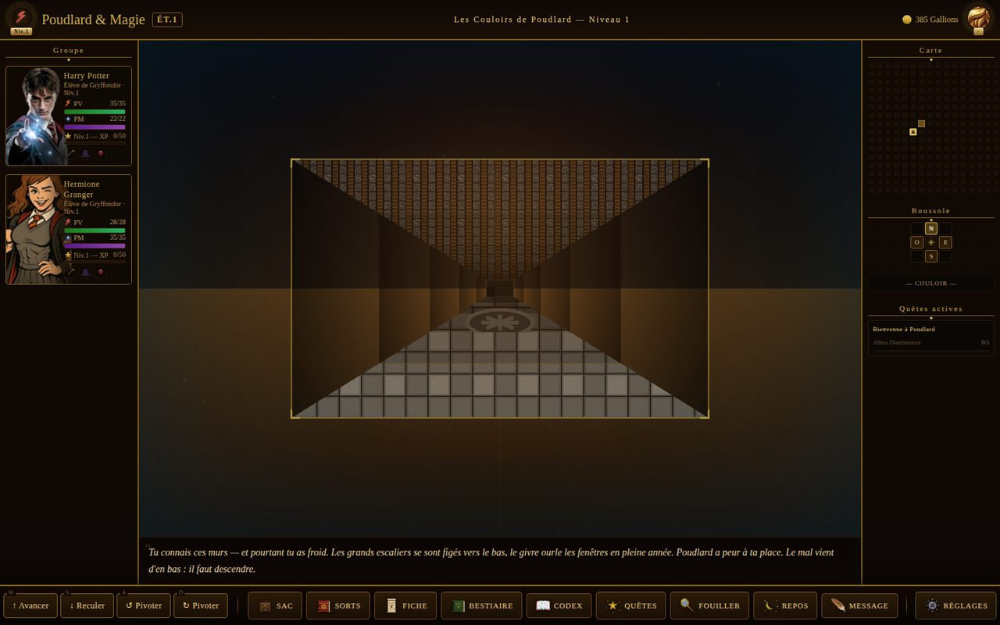
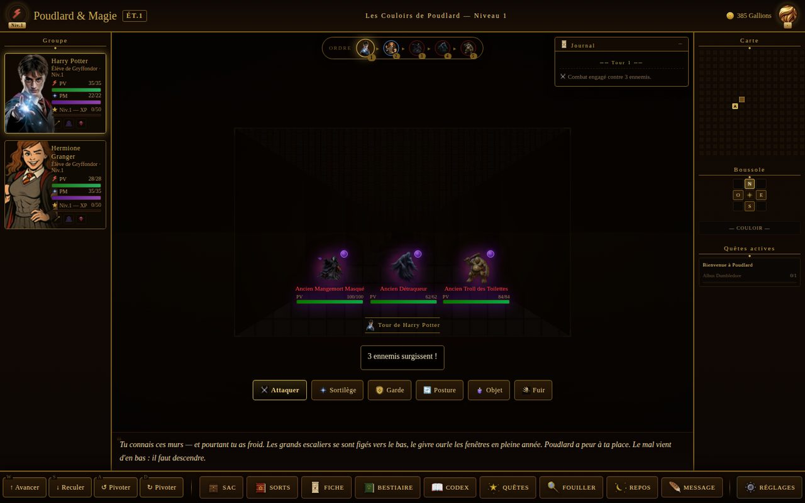
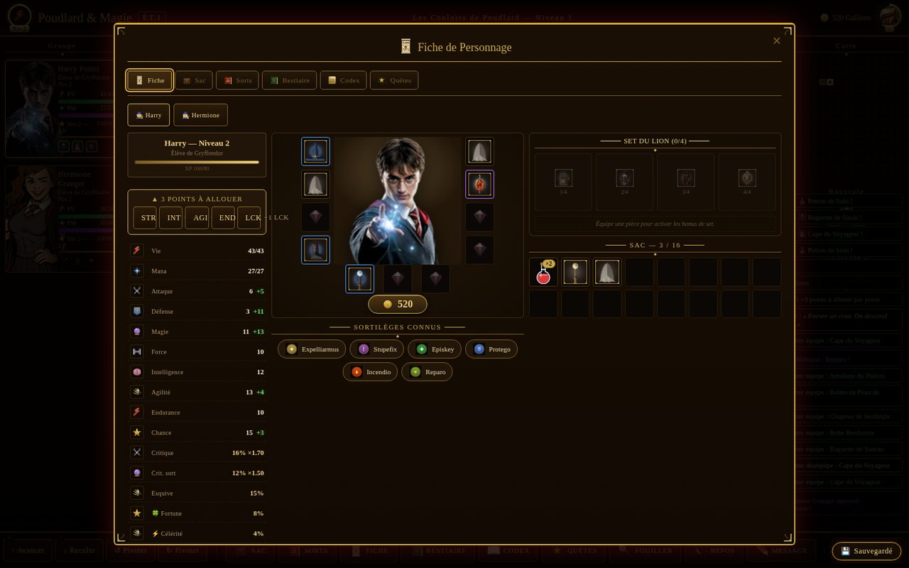
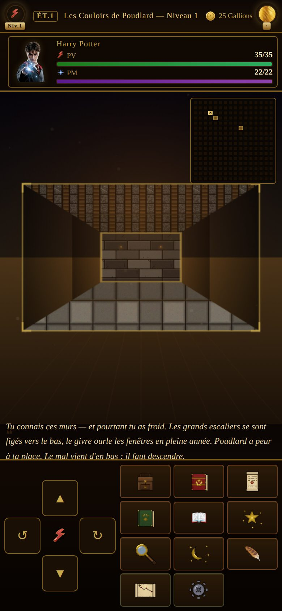

# Poudlard & Magie : Les Secrets de Poudlard

> **Un dungeon-crawler en tour par tour sous Poudlard, à l'ancienne — et le
> mal vient d'en bas.**
>
> - 🏰 Vue pseudo-3D, 4 Maisons, ~100 créatures, un endgame qui boucle sur
>   lui-même — dans la lignée de *Might & Magic Book One* ;
> - 🗝️ Des secrets à tous les étages : grimoire d'Élara, Poches du Sceau,
>   Chambres des Fondateurs, « Briser le Cycle » ;
> - ⚙️ **Vanilla JS / Canvas** : zéro dépendance, zéro build step, jouable
>   hors-ligne.

🎮 **Jouer maintenant : <https://kenhuri69.github.io/hogwarth/>**

> Installable comme application (Android / iOS / desktop) et **jouable
> hors-ligne** après une première visite. Nouveautés : voir le
> [CHANGELOG](./CHANGELOG.md).

---

## 📸 Aperçu

| | |
|---|---|
|  |  |
| *Exploration — couloirs de Poudlard, minimap, boussole* | *Combat tactique — groupe de 3 créatures, frise d'initiative* |
|  |  |
| *Fiche personnage — paper-doll 11 emplacements, stats dérivées* | *Mobile — D-pad tactile et gestes de swipe* |

## ✨ Fonctionnalités

- 🏰 **Donjon en vue pseudo-3D** : exploration au tour par tour, génération
  procédurale, minimap, coffres, boutiques, fontaines, pièges et énigmes.
- ⚔️ **Combat tactique** : système élémentaire (résistances/faiblesses),
  statuts (brûlure, gel, peur, étourdissement…), critiques physiques & de
  sorts, postures de duo, artefacts actifs, et une centaine de créatures.
- 🪄 **Sortilèges & progression** : apprentissage par niveau, livres de sorts,
  équipement à 11 emplacements, rework de stats à débouchés réels (Fortune,
  Célérité…).
- 🧪 **Potions & artisanat** : besace d'herboriste + chaudron de concoction.
- 🦁 **4 Maisons** : bonus, quêtes signature et cosmétiques distincts, sans
  jamais rompre l'équité d'équilibrage.
- ♾️ **Endgame & rejouabilité** : Boucle Ténébreuse (prestige infini),
  Chambres des Fondateurs, « Briser le Cycle » (vraie fin), New Game+,
  mode Ironman + Hall of Fame classé.
- 🌐 **Mondes Parallèles** : visites asynchrones inter-mondes et duels PvP.
- 📖 **Bestiaire & Codex** : journal vivant qui se déverrouille en jouant.
- 🔊 **Audio adaptatif** : musique d'ambiance par zone, musique de combat par
  contexte, effets et voix optionnelle.
- 📱 **Mobile-first** : D-pad tactile, gestes de swipe, layout responsive.

## 🎮 Contrôles

Les déplacements sont **relatifs au regard** (style dungeon crawler) ; toutes
les touches sont **remappables** dans Réglages → Clavier.

| Action | Clavier | Souris / Desktop | Mobile |
|--------|---------|------------------|--------|
| Avancer | ↑ / W / Z | bouton « Avancer » | ▲ du D-pad, swipe ↑ |
| Reculer | ↓ / S | bouton « Reculer » | ▼ du D-pad, swipe ↓ |
| Pivoter à gauche / droite | ← → / A Q / D | boutons « Pivoter » | ↺ ↻ du D-pad, swipe ← → |
| Fermer une modale | Échap | ✕ | ✕ |
| Actions de combat | raccourcis 1-9 + G (Garde) | boutons d'action | boutons d'action |

En jeu : 🎒 Sac, 📖 Sorts, 📜 Fiche, 📕 Bestiaire, 📔 Codex, ⭐ Quêtes,
🔍 Fouiller, 💤 Repos, et ⚙️ Réglages (sauvegarde 3 slots + auto, son,
difficulté, aide). Un **tour guidé** narré est proposé aux nouveaux joueurs.

## 🛠️ Stack technique

- **Vanilla JavaScript** + **HTML5 Canvas**, **zéro dépendance runtime**,
  **zéro build step**.
- Modules chargés via `<script>` séquentiels partageant le scope global.
- **PWA** : Service Worker maison (précache du shell + cache à la demande des
  assets), jouable hors-ligne.
- Déploiement **GitHub Pages** via GitHub Actions (`.github/workflows/deploy.yml`).

## 🚀 Lancer en local

Aucune installation n'est requise pour jouer — il suffit de servir le dossier
en HTTP (le Service Worker et le `fetch` des assets nécessitent `http://`,
pas `file://`) :

```bash
python3 -m http.server 8000
# puis ouvrir http://localhost:8000/
```

## ✅ Tests

Le **jeu** n'a aucune dépendance ; seul le harnais de test utilise Playwright.

```bash
npm install                 # installe Playwright (dev uniquement)
npx playwright install chromium

node tests/units.js         # tests unitaires purs (Node, sans navigateur)
node tests/smoke.js         # tests fonctionnels (Chromium headless)
node tests/pwa-smoke.js     # tests PWA (offline, manifest, service worker)
```

Garde-fous CI (exécutés à chaque PR) :

```bash
node tools/check_cache_versions.js --base origin/master   # cache PWA à jour
node tools/check_doc_modules.js                           # arbo ↔ index.html
node tools/check_difficulty.js --base origin/master       # équilibrage stable
```

## 📚 Documentation

- **`CHANGELOG.md`** — nouveautés, curatées par thèmes.
- **`CLAUDE.md`** — mémoire projet & architecture (source de vérité technique).
- **`docs/histoire/`** — les 14 chapitres de narration & game-design.
- **`docs/gameplay/`** — chapitres de gameplay (combat, économie, endgame…).
- **`docs/REVUE-TRANSVERSALE-ET-ROADMAP.md`** — revue narration & roadmap.
- **`DIFFICULTY_REPORT.md`** — étude d'équilibrage (simulation Monte-Carlo).

## 📦 Statut

**Release Candidate** — jeu fonctionnellement complet et équilibré, en phase
de polish final avant une mise à jour publique majeure.

---

*Projet de fan non officiel, à but non commercial, inspiré de l'univers
Harry Potter. Tous droits sur l'univers d'origine appartiennent à leurs
détenteurs respectifs.*
